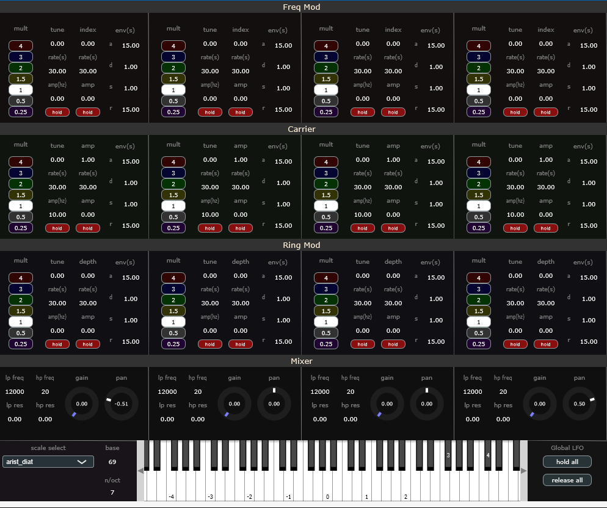
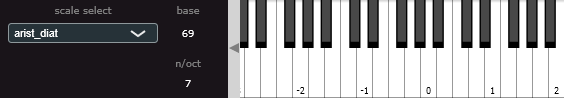
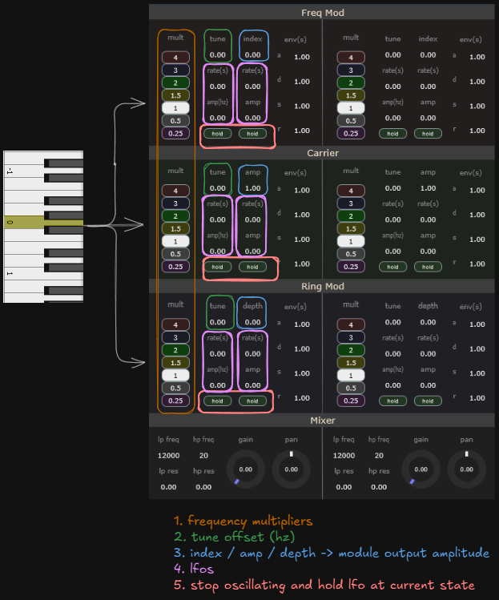

## Sines

Four tone, eight voice synth geared towards generating pycho-acoustic phenomena



### Prequisites
To build the project you'll need `CMake` >= 4.0, ninja, and an appropriate compiler.

### Build

1. Clone the project, then enter the directory
```
git clone https://github.com/prwhitegsf/Sines.git
cd Sines
```

2. Generate the build files
```
cmake -B Builds -G Ninja -DCMAKE_BUILD_TYPE=Release
```

3. Compile
```
cmake --build Builds --config Release
```

### Or download pre-built files
- [Windows](https://www.philipwhiteaudio.com/media/Sines.zip)
- [Mac](https://www.philipwhiteaudio.com/media/Sines.zip)

### Usage




While PPP allows for standard equal temperament tuning, one of its defining features is the ability to work with several different tuning systems.
Use the dropdown to select the desired tuning. The keyboard updates to show where the octaves occur when the tuning does not have 12 notes/octave.



We refer to each column group (consisting of sub modules Freq Mod, Carrier and Ring Mod) as a tone

When a key is pressed:
1. the midi note is converted to the selected scale's frequency
2. that frequency is sent to each tone's Freq Mod, Carrier and Ring Mod
3. the frequency is then altered / modulated independently in each unit in this order:
- (1) a frequency multiplier: transforms the pressed note up / down by octaves (0.25, 0.5, 1.0, 2.0, 4.0) or up by fifths (1.5, 3.0)
- (2) a tune offset in hz
- (4) a tune lfo centered around the resulting frequency
- This is the same for Freq Mods, Carriers and Ring Mods

Additionally, each sub module has an index / amp / depth parameter (3) corresponding the amplitude of the signal provided by the module
- For the Freq Mod, this is the index. It controls the amplitudes of the overtones generated by the Freq Mod.
- For the Carrier, this is the output amplitude (volume) of the carrier signal.
- For the Ring Mod, this is Dry/Wet control with 1 = fully wet and 0 = dry
- In contrast to the tune lfo's, the lfo's associated with index / amp / depth have as their max value the index / depth /amp and are thus centered at index - (amp/2)

The mixer section provides high and low pass 24db ladder filters along with gain and pan control for each tone.

### OSC Control
Synth Parameters are controllable via OSC input. Sines receives input on port 9000.
Parameters expect a value between 0 and 1, which is automatically scaled to the parameter's range.

**Addressing**
Generally:
- `oscNum/module/parameter`

Modules:
`fm` = frequency modulator
`cr` = carrier oscillator
`rm` = ring modulator
`mix` = mixer (level, pan, and filters)

Parameters (fm, cr, rm):
`tune`
`tuneRate`
`tuneAmp`
`tuneHold`
`depth`
`depthRate`
`depthAmp`
`depthHold`

Parameters (mix):
`level`
`pan`
`hp/freq`
`hp/res`
`lp/freq`
`lp/res`

Examples:
- `1/fm/tune {value}` - control the tune parameter of the frequency modulator in the first oscillator unit
- `2/cr/tuneRate {value}` - control the rate of the tune modulator on the carrier in the second oscillator unit
- `4/mix/hp/freq {value}` - control the high pass filter frequency on the fourth oscillator unit